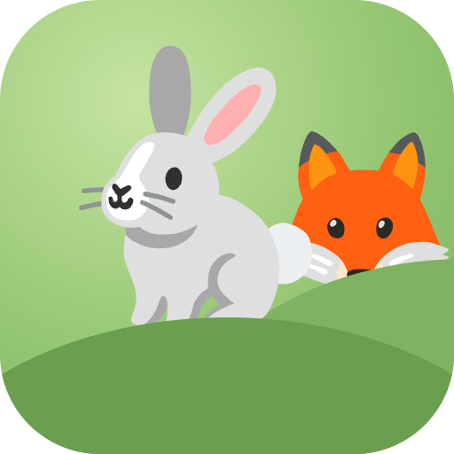
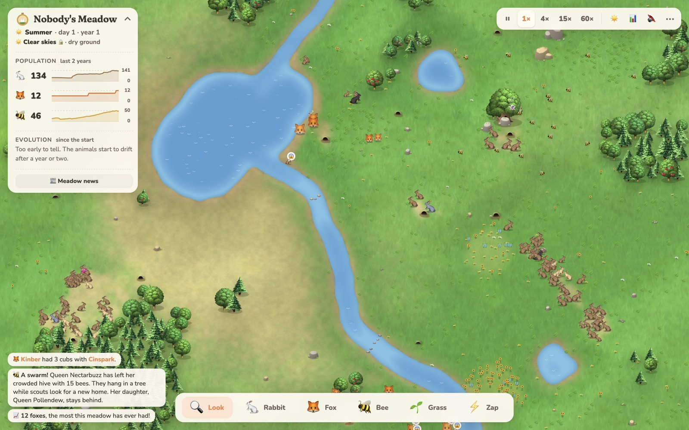
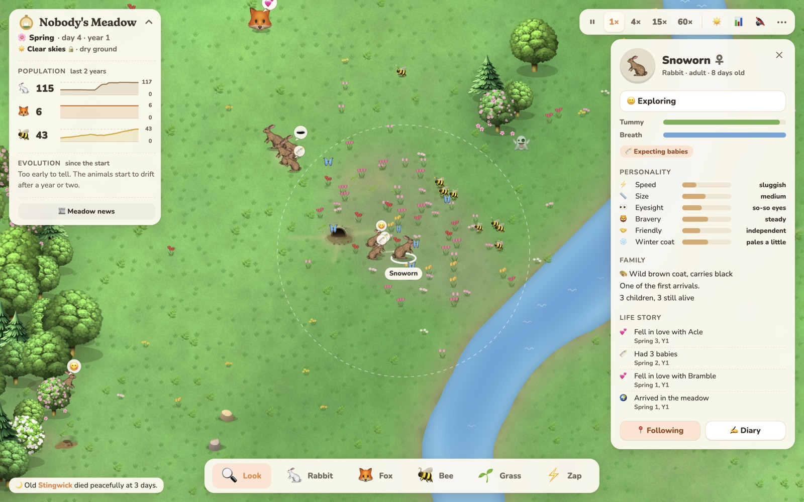
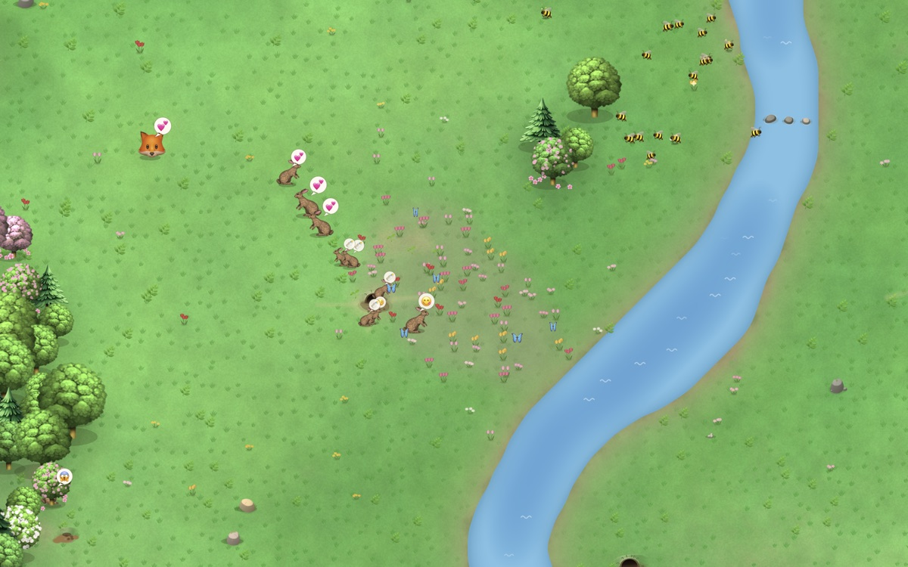
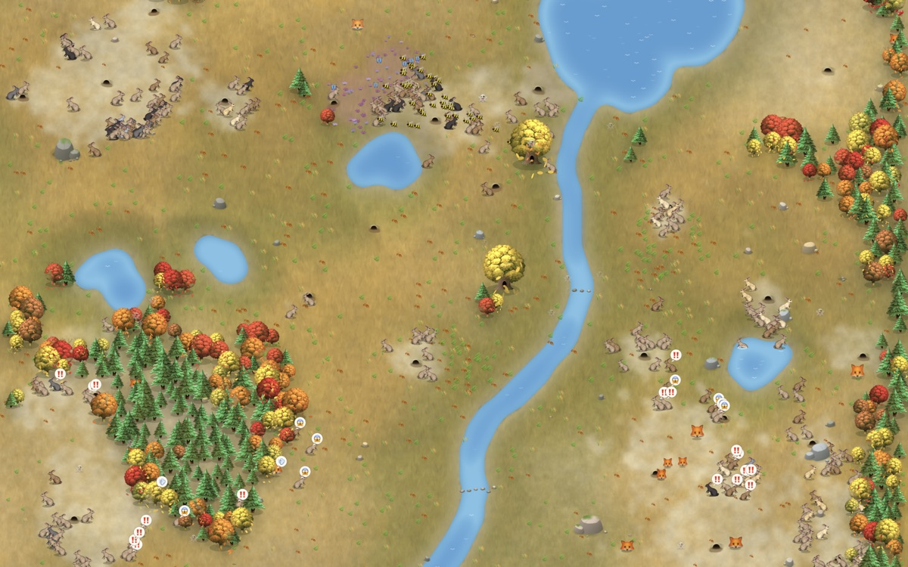
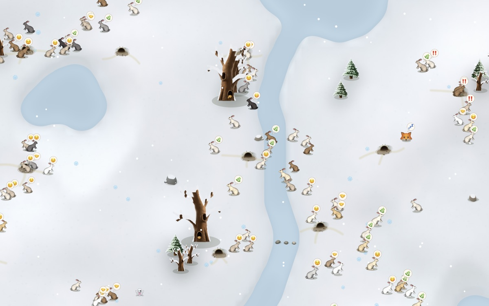

<p align="center">
  
</p>

<h1 align="center">Nobody's Meadow</h1>

<p align="center"><em>A meadow that keeps its own time.</em></p>

<p align="center">
  <a href="https://askel-dev.github.io/aeon-garden/"><strong>▶ Play it in your browser</strong></a>
</p>



A small meadow where rabbits, foxes and bees live their own lives. Nobody tells them what to do.
They graze, fall in love, raise families and run for their burrows. Every baby is a mix of its
parents, with a small twist.

The meadow keeps its own time. A day goes by in twenty seconds, a year in a few minutes. Leave it
running, and over the years the animals slowly change: populations boom and crash, coats shift
with the ground they hide on, and the bees swarm off to find new hollow trees.



## Four seasons

<table>
  <tr>
    <td></td>
    <td></td>
    <td></td>
  </tr>
  <tr>
    <td align="center">Spring</td>
    <td align="center">Autumn</td>
    <td align="center">Winter</td>
  </tr>
</table>

- **Spring**: the river rises over its floodplain, fruit trees blossom and the first flower fields open. A flooded burrow is lost.
- **Summer**: the water falls back, butterflies loop over the fields, and fireflies blink by the water at night.
- **Autumn**: the woods turn red and gold, and windfall apples draw the rabbits (and the foxes) to the apple trees.
- **Winter**: snow lies, rabbits with the right genes turn white, and the water freezes, so foxes can cross where they couldn't before.

## What lives here

- **Rabbits** dig their own burrows, and neighbours help finish them. Their coats come from two genes, and a fox spots a still rabbit sooner when its coat stands out from the ground.
- **Foxes** hunt by sight, so fog, snow and a good coat all help a rabbit get away. Deep water stops them, shallow fords don't.
- **Bees** live in a hollow in an old tree. They sip from the flower fields, dance to show the others the way to a rich patch, and put honey by for winter. A crowded hive swarms: the old queen takes half the bees off to hang in a tree while scouts look for a new home.
- **The weather** has a life of its own: rain greens the meadow, fog hides the foxes, thunder sends rabbits home, and lightning on dry grass can start a wildfire.

Every meadow is different: a river, a lake or both, a few ponds, woods, great rocks and named flower fields.
`?seed=123` in the address replays one.

## Playing

- Click an animal to follow its whole life, or anything else (a hive, a tree, a burrow, a field) to see what it is
- Scroll to zoom, drag to look around. On a phone: pinch and drag
- The tools at the bottom (or right-click the meadow) add rabbits, foxes and bees, grow grass, or strike lightning
- Change the weather, or 🔒 lock it, from the sky button at the top
- Quiet sounds and a little felt piano now and then, off until you press 🔊 or M
- With [Ollama](https://ollama.com) running, the ✍️ Diary button lets an animal write about its day

Keys: <kbd>Space</kbd> pause, <kbd>1</kbd>–<kbd>4</kbd> speed, <kbd>S</kbd> stats, <kbd>N</kbd> news, <kbd>W</kbd> weather,
<kbd>K</kbd> lock the weather, <kbd>F</kbd> follow, <kbd>M</kbd> sound, <kbd>P</kbd> copy the meadow as a picture, <kbd>Esc</kbd> close.

It runs on phones too. Add it to your home screen and it opens like an app.

## Running it yourself

No build step, no dependencies. Serve the folder and open it:

```bash
python3 -m http.server 8765
```

Then open http://localhost:8765.

- `sim.js` is the world, `game.js` draws it, `ground.js` paints the ground with WebGL, `sound.js` makes every sound with Web Audio
- `node balance.js [years] [seeds]` runs meadows headless and prints how the populations did
- `index.html?lab` opens the terrain lab: sliders for every terrain number, and a brush to draw your own water, rivers and woods
- `sound-lab.html` plays each sound and piece of music on its own
